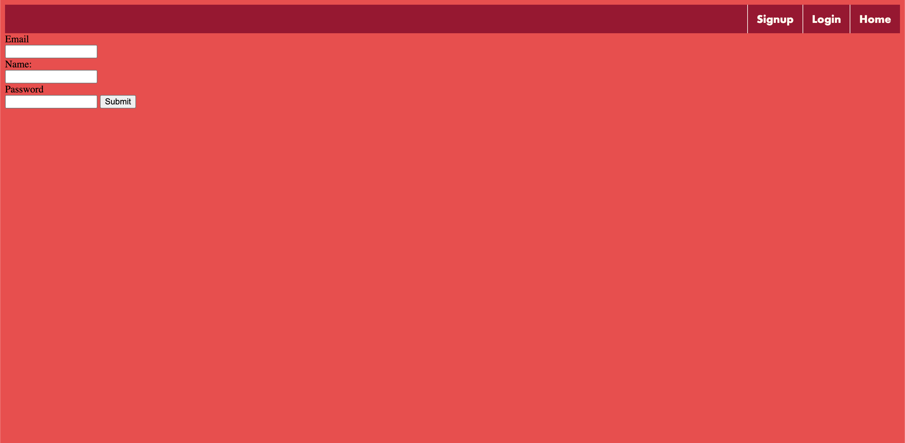

# GoWebServer

In an attempt to understand backend programming,
I created a webserver in Go that can create users
(signup) in a postgreSQL database. I also practised basic CSS and 
Javascript, as well as form handling.

## How to use

- Clone the repository
- Run the *setup.sql* 
- In */database/userdb.go*, change the credentials to your own
local database
- Run *main.go* and open your web browser on http://localhost:8000

